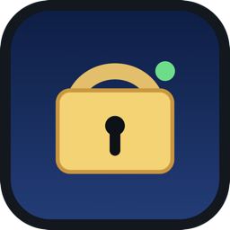
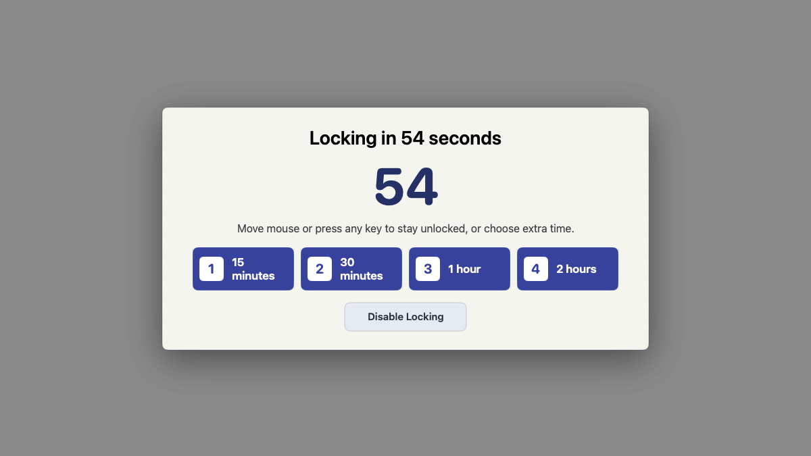

<p align="center">
  
</p>

<h1 align="center">Lock Anyway</h1>

<p align="center"><strong>Apps can keep your Mac awake. Not unlocked.</strong></p>

<p align="center">
  Lock Anyway is a native macOS menu-bar utility that locks your Mac after real keyboard and mouse inactivity—even when media, remote access, or another process keeps the display awake.
</p>

<p align="center">
  <a href="https://autonomath.github.io/lock-anyway/"><strong>Website</strong></a>
  ·
  <a href="https://github.com/autonomath/lock-anyway/releases/latest/download/LockAnyway.dmg"><strong>Download for Mac</strong></a>
  ·
  <a href="https://autonomath.github.io/lock-anyway/support/"><strong>Support</strong></a>
</p>



## Install

Lock Anyway is free, Apple-notarized, and currently supports Apple-silicon Macs running macOS 13 or later.

1. [Download LockAnyway.dmg](https://github.com/autonomath/lock-anyway/releases/latest/download/LockAnyway.dmg).
2. Open the DMG and drag **Lock Anyway.app** to Applications.
3. Eject the DMG and open Lock Anyway from Applications.
4. If macOS asks, grant Accessibility permission so the app can press the native Lock Screen shortcut.

No Terminal, account, or installer package is required.

### Updating from Idle Lock

Quit the old **Idle Lock** menu-bar app and remove `Idle Lock.app` from Applications before installing Lock Anyway. Because the application path changed, macOS may ask for Accessibility permission again.

## What It Does

- Reads the macOS HID idle-time counter without recording keys or clicks.
- Shows a clear countdown before locking.
- Cancels immediately when local keyboard or mouse activity resumes.
- Lets you add 15 minutes, 30 minutes, one hour, or two hours.
- Lets you pause briefly or until manually resumed.
- Opens the native macOS Lock Screen when the timer expires.
- Starts at login when enabled.

## Why It Exists

You set macOS to lock after a few minutes, then leave the desk expecting it to protect itself. A browser tab, meeting, remote-access session, download, or misbehaving process keeps the display awake longer than expected.

Lock Anyway does not care whether the display is awake. It asks one question: **has anyone touched the local keyboard or mouse recently?** If not, it warns you and locks the Mac on your schedule.

It is not a keep-awake app, break timer, proximity lock, or MDM policy tool.

## Privacy

Lock Anyway has no account, analytics, advertising, cloud service, or network feature. It stores only your preferences and local diagnostic logs. Read the [privacy policy](https://autonomath.github.io/lock-anyway/privacy/) or inspect the source.

## Development

Build the app:

```sh
scripts/build-app.sh
```

Run the self-test suite:

```sh
swift run IdleLockSelfTest
```

Reload the canonical development installation:

```sh
scripts/reload-app.sh
```

Create a signed DMG:

```sh
scripts/package-dmg.sh
```

See the [development guide](docs/DEVELOPMENT.md), [install guide](docs/INSTALL.md), and [troubleshooting guide](docs/TROUBLESHOOTING.md) for details.

## License

Lock Anyway is available under the [MIT License](LICENSE).
